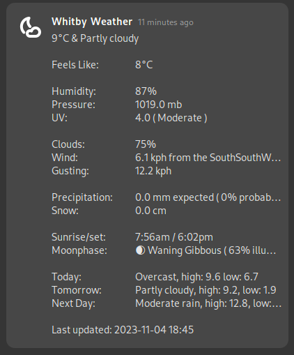

# GweatherAPI
Gnome weather notifications from weatherAPI.com

This script queries the weatherAPI data service for current and forecast weather data
and outputs a self-overwriting notification bubble with weather conditions 

Features:
- uses the weatherAPI.com API
- updates existing notification bubble in notifcation area

Requires: curl jq [moon phase glyphs font support like nerd-fonts-symbols] [weatherapi.com free account]

